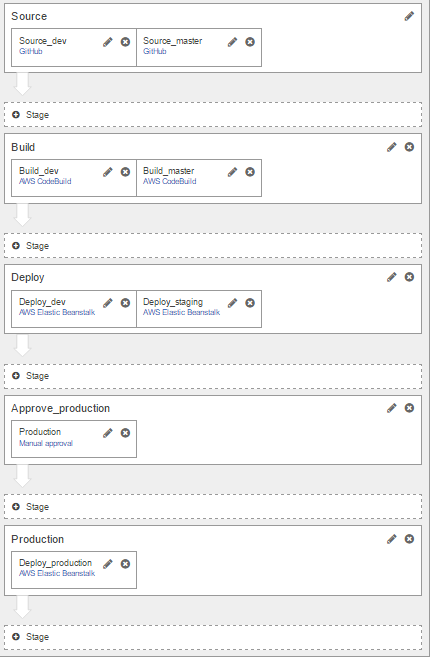

# How to deploy the example app to Amazon AWS (without using ElasticBeanstalk) (and without CircleCI)

1. You need to set up some basics in Amazon EC2: Create a Amazon EC2 Instance. I chose amzn-ami-2016.09.d-amazon-ecs-optimized (ami-5b6dde3b) because we need a working docker environment in the image.
   More info here [Amazon ECS-optimized AMI](http://docs.aws.amazon.com/AmazonECS/latest/developerguide/ecs-optimized_AMI.html)

   **Useful**
   You may want to add a key pair to your instance so you can SSH into it later if you experience any problems.

   **Important**
   I had to add the role AmazonEC2ContainerServiceforEC2Role to my instance otherwise the cluster I created (see below) could not find any instance.
   See this [Stackoverflow topic](http://stackoverflow.com/questions/36523282/aws-ecs-error-when-running-task-no-container-instances-were-found-in-your-clust)
   
2. Create a cluster (a cluster can contain one or more EC2 instances)

3. Create a task definition (this specifies which docker image you want to run).  You can use most default settings, except:
        
        1) Set correct container name, repository name and docker image tag
        2) You need to add a port mapping for running and exposing the ports used by the app. Add port Host 80 and Container port 80, protocol TCP.
        3) Add environment variables (if you have an app that needs this)

4. Make sure that your repository contains the docker image/tag.

5. Create a Service (set number of tasks to one) and add the previous task definition

5. Make sure that inbound http 80 is set for your instance (configure in security groups)

6. AWS will now try to start the task. Make sure the status is 'RUNNING' and there are no errors in events tab in service.
   Also check there are no errors in task under container details. 

7. You can find your app url in the current running task under container. (Under column external link)

8. Click the link. Hopefully your app is now displayed.

# How to deploy the example app to Amazon AWS (using Elastic Beanstalk) (and using CodeBuild/CodePipeline)

In this repository a sample **buildspec.yml** is included. CodeBuild uses this information to know how to build your project.
(*it's the same as the circle.yml for CircleCI*).

Because AWS CodeBuild currently doesn't offer us a Docker image that has NodeJs installed I do install NodeJS and npm into the docker image.
Also Mocha is being installed to run tests before deploying.

See http://docs.aws.amazon.com/codebuild/latest/userguide/build-env-ref.html

Ubuntu 14.04	Docker	1.11.2	AWS CLI, Git 1.9.1, pip 8.1.2, Python 2.7	aws/codebuild/docker:1.11.2
Ubuntu 14.04	Docker	1.12.1	AWS CLI, Git 1.9.1, pip 8.1.2, Python 2.7	aws/codebuild/docker:1.12.1

*Note: A better scenario would be that we create a custom docker image and use that for CodeBuild so we don't have to install each package again and again.
But this works good enough for me now.*

Setting up **CodeBuild** isn't that hard. Just give it some basic information like 
- Name of your app/project
- Source of your project (github, ..)
- How to build (what docker image to use. I used **aws/codebuild/docker:1.12.1**)
- Specify you want to use existing **buildspec.yml** in the source code root directory
- Add environment variables if necessary

Creating a **CodePipeline** is also easy using the web interface.

See my example:

I have added like 5 stages (and each stage consists of one ore more actions): 

- Source
    - Source_dev
    - Source_master
- Build
    - Build_dev
    - Build_master
- Deploy
    - Deploy_dev
    - Deploy_master
- Approve
    - Approve
- Production
    - Deploy_production

But CodeBuild/CodePipeline has some limitations in my opinion:

- When a build for dev is triggered it triggers a deploy for dev and staging (it should only deploy to dev).
- There is no integration possible between CodePipeline and CircleCI (if you don't want to use CodeBuild)
- Tests that fail in CodeBuild are not easy to retrieve. You must first download the logs and search in the logs.
  Whereas in CircleCI you see it a lot faster because you see output for each building step (and you can add a Test tab there for displaying all tests)

# How to deploy the example app to Amazon AWS (using Elastic Beanstalk) (and using CircleCI)

This guide will help you deploy a Docker application to AWS Elastic Beanstalk.
We will use 

**CircleCI** for continous integration

**Amazon Elastic Beanstalk** as a service to help you deploy your Docker application easily 

**Elastic Beanstalk** makes it very easy to deploy your application to Amazon. It will do a lot of stuff for you like creating EC2 instances, setting up storage, assigning security groups, etc..

## Assumptions

### CircleCI

You have added this project in CircleCI.

### Environments
I assume you want 3 environments for your application : development, staging and production 
              and you have 2 (git) branches: **develop** and **master** (of course branch names can differ a bit)

### Branches
Develop is your development branch. (= development environment).

Master branch represents a working/production ready state of your code. 

### Docker images storage
Docker images need to be stored somewhere (Docker Hub, Amazon Container Service, etc ...) before they can be deployed to Elastic Beanstalk. I chose Amazon Container Service.
If you want to use another registry you will have to edit the shell script a bit.

### Versioning
All docker images are stored on Amazon. For development we do not store multiple docker image versions. So it will replace the docker image with tag 'dev' every time.
For staging: we give the tag the version number specified by the package.json file.

### Deploying to production
To deploy to production you want to use the ElasticBeanstalk web interface to deploy a specific version (choose a version that is ready and tested).
It is very easy to deploy different application versions to whatever environment you want. 

### Application name is the same in Elastic Beanstalk as your docker repository name
My script assumes both are the same. But nothing stops you from editing the script.

## What does the script do ?
Whenever you commit on develop/master branch, CircleCI should trigger a build. Then it will run this script
**deploy_aws_elasticbeanstalk.sh** with parameter **'dev'** or **'staging**'.

The script contains a simple Mocha test. If the test passes, it will

1) Login to AWS, 
2) Build a docker image of your current build, 
3) Store this docker image,
4) Deploy to the correct ElasticBeanstalk environment.
     For Dev: it will create a version label: development_GITHASH. **Important: because we only store 1 docker image for dev this hash doesn't 
     For staging: it will create a version label which is the current version of package.json

## Preparation AWS

1. Create a S3 Bucket. 

## Preparation

1. Make sure you have your Docker working and you can launch the example app on your machine in Docker.

2. Install AWS CLI. See [Installing the AWS Command Line Interface](http://docs.aws.amazon.com/cli/latest/userguide/installing.html)

   *Note: this might not be required because CircleCI has AWS CLI installed and the script will be started from CircleCI.
   But it is very useful to have when you have problems and want to test it from your machine
   But. You will need it if you want your ElasticBeanstalk to load a docker image from a private docker repository*

3. Try to login to AWS with your AWS CLI. Open a cmd and type in 
    `aws ecr get-login`. Now copy paste the output and execute it (it is a docker login command with a long secret key:  `docker login -u AWS -p xxxxxxxxxxxxxxxxxxxxxxxxxxxxxxxxxxxxxxx -e none https://amazonaws...`).
    Make sure Login succeeds.

## Configuration

1. Under deploy\aws_dev edit Dockerrun.aws.json so that "Bucket" and "Key" are your bucket name and use config.json as "Key". 

2. Under deploy\aws_staging edit Dockerrun.aws.json so that "Bucket" and "Key" are your bucket name and use config.json as "Key".

3. **Necessary only if you use AWS Container Service for storing private Docker images** 
    You will need to edit the config.json file. Under 'preparation' folder you will find an empty config.json. We will store this file in a next step in S3 because ElasticBeanstalk must be able to get this config file and be able to authenticate.
        Edit the config.json file so that auth and email are filled in. 
        **auth**: You can find your auth secret under your .docker folder (mine was located at C:\Users\Wim\.docker). I use Windows machine. 
                   You need to have logged in successfully or you won't find a key here.
        **email** Your email for logging in to AWS Console.

4. Go to EC2 Container Service. Under repositories create a repository to hold your docker images.

5. Go to S3 and upload the edited config.json file to your bucket.

6. Create a new Application in Elastic Beanstalk. You want to create 3 environments. I named them caseDockerApi-dev, caseDockerApi-staging and caseDockerApi-production.
   For each environment:
   - You need to choose an environment tier: choose Web server environment.
   - Choose Docker as Platform
   - Upload your code: upload the Dockerrun.aws.json
   - Enter the name for your environment

   The app will not work yet as the docker image is not uploaded yet in your EC2 Container Service repository. But this should be fixed when the script is executed.
   
7. Edit deploy/aws_dev/Dockerrun.aws.json
     `708547824206.dkr.ecr.us-west-2.amazonaws.com/case-docker-api:dev` with your repository name (which you can find in your EC2 Container Service repositories). Don't forget that it should still end with `:dev`

8. Edit deploy/aws_dev/Dockerrun.aws.json
     `708547824206.dkr.ecr.us-west-2.amazonaws.com/case-docker-api:latest` with your repository name (which you can find in your EC2 Container Service repositories). Don't forget that it should still end with `:latest`

9. Add environment variable to CircleCI. 
    1. AWS_ACCOUNT_ID with your AWS account id

10. Edit `circle.yml`:
        1. Replace parameters for `deploy_aws_elasticbeanstalk.sh`
            1st parameter should be the ending of the environment name in Elastic Beanstalk
            2nd parameter is your application name in Elastic Beanstalk
            3rd parameter is your bucket name
            4th parameter is the region (it is important!)
            5th parameter is your AWS ElasticBeanstalk app environment name
            6th parameter is yout AWS Docker repository url

        *Note: You can also use environment variables in CircleCI instead of passing these hardcoded in circle.yml.* 

11. Add permissions/roles so Elastic Beanstalk (?)

12. Add environment variable to your Elastic Beanstalk app environment. Go to Configuration, then Software Configuration and Add environment variable "PORT" with value 80 

## Let CircleCI do it's job

Now if you commit to develop branch or master branch, it should automatically deploy your app to Amazon.

## How to deploy to production ? 

If you want to deploy to production you can use the web interface of Elastic Beanstalk. Just go to Application Versions, choose your version and click 'Deploy'. Finally you choose the environment (=production)

# Helpful resources / References

[What is Elastic Beanstalk](http://docs.aws.amazon.com/elasticbeanstalk/latest/dg/Welcome.html)

[Full example on how to deploy to Elastic Beanstalk](https://gist.github.com/yefim/93fb5aa3291b3843353794127804976f)

[CircleCI and AWS](http://mohtasebi.com/docker/aws/2016/03/08/ci-using-aws-ecs-docker.html)

[Amazon Developer guide EC2 Container Service](http://docs.aws.amazon.com/AmazonECS/latest/developerguide/Welcome.html)

[Deploy Docker container: tutorial](https://aws.amazon.com/getting-started/tutorials/deploy-docker-containers/)